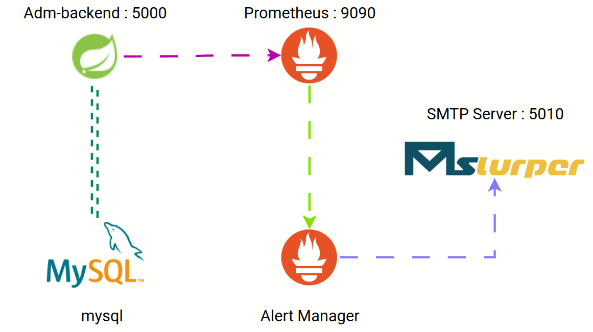

# Java Spring Monitoring

## Overview

This serves as a demonstration of REST API design and monitoring integration using Prometheus and Alert Manager for educational purposes.

### Features
- Authentication endpoint `restapi/v1/auth/signin` which returns a json web token necessary for accessing protected routes.
- Protected endpoint `restapi/v1/test` that can only be accessed with a valid JWT.
- Alongside default spring metrics, custom metrics related to token generation and usage are exposed.
- Alerting: An alert is triggered if there is an increase of 5 or more instances of unauthorized access attempts with expired tokens within a 20-second window.
- Local SMTP: Alerts are configured to notify via email through a local SMTP server accessible at `localhost:5010`.

## Steps to Run

To run this application locally, you will need:
- Docker (version 27.1.2 was used)
- Maven  (version 3.9.0 was used)

From the project root directory:
1. Run `mvn -f adm/pom.xml clean package`.
2. Run `docker compose build`.
3. Run `docker compose up`.

All passwords are '123456'.